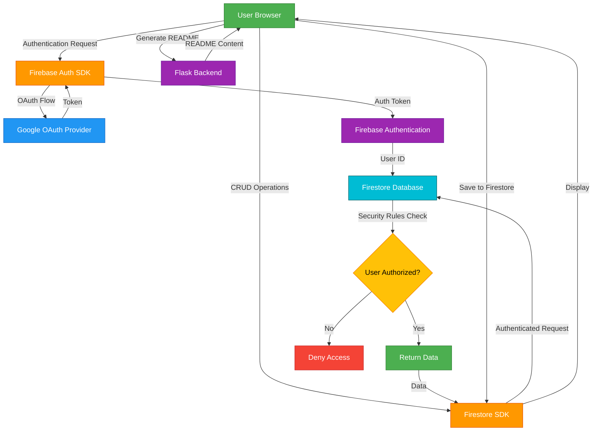
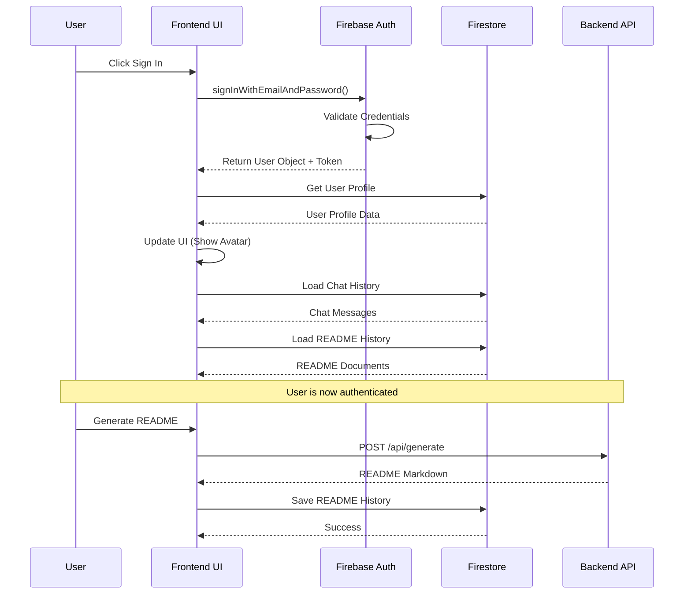

# Firebase Authentication & Firestore Design Document

## Overview

This design document outlines the implementation of Firebase Authentication and Firestore database integration for GitRefiny. The system will provide secure user authentication via email/password and Google OAuth, persistent storage of user profiles, chat history, and README generation history. The architecture follows Firebase best practices with client-side SDK integration and Firestore security rules for data protection.

## Architecture

### High-Level Architecture



### Authentication Flow



## Components and Interfaces

### Frontend Components

#### 1. Firebase Configuration Module (`frontend/firebase-config.js`)
```javascript
// Firebase SDK initialization
const firebaseConfig = {
  apiKey: process.env.FIREBASE_API_KEY,
  authDomain: process.env.FIREBASE_AUTH_DOMAIN,
  projectId: process.env.FIREBASE_PROJECT_ID,
  storageBucket: process.env.FIREBASE_STORAGE_BUCKET,
  messagingSenderId: process.env.FIREBASE_MESSAGING_SENDER_ID,
  appId: process.env.FIREBASE_APP_ID
};

export const app = initializeApp(firebaseConfig);
export const auth = getAuth(app);
export const db = getFirestore(app);
```

#### 2. Authentication Service (`frontend/auth-service.js`)
```javascript
class AuthService {
  // Sign up with email/password
  async signUp(email, password, displayName)
  
  // Sign in with email/password
  async signIn(email, password)
  
  // Sign in with Google
  async signInWithGoogle()
  
  // Sign out
  async signOut()
  
  // Get current user
  getCurrentUser()
  
  // Listen to auth state changes
  onAuthStateChanged(callback)
}
```

#### 3. Firestore Service (`frontend/firestore-service.js`)
```javascript
class FirestoreService {
  // User Profile Operations
  async createUserProfile(userId, userData)
  async getUserProfile(userId)
  async updateUserProfile(userId, updates)
  
  // README History Operations
  async saveReadmeHistory(userId, readmeData)
  async getReadmeHistory(userId, limit = 50)
  async deleteReadmeHistory(userId, docId)
  
  // Chat History Operations
  async saveChatMessage(userId, message)
  async getChatHistory(userId, limit = 100)
  async clearChatHistory(userId)
}
```

#### 4. UI Components Updates

**Auth Modal Enhancement:**
- Add loading states for sign-in/sign-up buttons
- Display Firebase error messages
- Handle Google OAuth popup
- Show success/error notifications

**Navigation Bar Enhancement:**
- Replace "Sign In" button with user avatar when authenticated
- Display user email on avatar hover
- Add dropdown menu with "Sign Out" option
- Show loading skeleton while checking auth state

**History Panel (New Component):**
- Display README generation history
- Show repository metadata (name, stars, languages)
- Provide delete and load actions
- Implement infinite scroll for large histories

**Chat Window Enhancement:**
- Load chat history on authentication
- Persist new messages to Firestore
- Display message timestamps
- Show "History loaded" indicator

## Data Models

### Firestore Collections Structure

#### Users Collection: `users/{userId}`
```javascript
{
  userId: string,           // Firebase Auth UID
  email: string,            // User email
  displayName: string,      // User display name
  photoURL: string | null,  // Profile photo URL (from Google)
  provider: string,         // "email" or "google"
  createdAt: Timestamp,     // Account creation date
  lastLoginAt: Timestamp    // Last login timestamp
}
```

#### README History Collection: `users/{userId}/readmeHistory/{docId}`
```javascript
{
  docId: string,                    // Auto-generated document ID
  userId: string,                   // Owner user ID
  repoUrl: string,                  // GitHub repository URL
  repoName: string,                 // Repository name
  repoOwner: string,                // Repository owner
  markdown: string,                 // Generated README content
  metadata: {
    stars: number,
    forks: number,
    languages: object,              // {language: percentage}
    techStack: array                // Detected technologies
  },
  generationOptions: {
    tone: string,                   // professional/concise/enthusiastic
    model: string                   // AI model used
  },
  createdAt: Timestamp,             // Generation timestamp
  updatedAt: Timestamp              // Last update timestamp
}
```

#### Chat History Collection: `users/{userId}/chatHistory/{docId}`
```javascript
{
  docId: string,            // Auto-generated document ID
  userId: string,           // Owner user ID
  role: string,             // "user" or "assistant"
  content: string,          // Message content
  timestamp: Timestamp,     // Message timestamp
  metadata: {
    model: string | null,   // AI model used (for assistant messages)
    tokens: number | null   // Token count (if available)
  }
}
```

### Firestore Security Rules

```javascript
rules_version = '2';
service cloud.firestore {
  match /databases/{database}/documents {
    
    // Helper function to check authentication
    function isAuthenticated() {
      return request.auth != null;
    }
    
    // Helper function to check ownership
    function isOwner(userId) {
      return isAuthenticated() && request.auth.uid == userId;
    }
    
    // Users collection
    match /users/{userId} {
      // Users can read and write their own profile
      allow read, write: if isOwner(userId);
    }
    
    // README History subcollection
    match /users/{userId}/readmeHistory/{docId} {
      // Users can only access their own README history
      allow read, write, delete: if isOwner(userId);
      
      // Validate data structure on write
      allow create: if isOwner(userId) 
        && request.resource.data.keys().hasAll(['userId', 'repoUrl', 'markdown', 'createdAt'])
        && request.resource.data.userId == userId;
    }
    
    // Chat History subcollection
    match /users/{userId}/chatHistory/{docId} {
      // Users can only access their own chat history
      allow read, write, delete: if isOwner(userId);
      
      // Validate data structure on write
      allow create: if isOwner(userId)
        && request.resource.data.keys().hasAll(['userId', 'role', 'content', 'timestamp'])
        && request.resource.data.userId == userId
        && request.resource.data.role in ['user', 'assistant'];
    }
  }
}
```

## Error Handling

### Authentication Errors

| Firebase Error Code | User-Friendly Message | Action |
|---------------------|----------------------|--------|
| `auth/email-already-in-use` | "This email is already registered. Please sign in instead." | Switch to sign-in mode |
| `auth/invalid-email` | "Please enter a valid email address." | Highlight email field |
| `auth/weak-password` | "Password must be at least 6 characters long." | Highlight password field |
| `auth/user-not-found` | "No account found with this email. Please sign up." | Switch to sign-up mode |
| `auth/wrong-password` | "Incorrect password. Please try again." | Clear password field |
| `auth/too-many-requests` | "Too many failed attempts. Please try again later." | Disable form temporarily |
| `auth/popup-closed-by-user` | "Sign-in cancelled." | Close modal silently |
| `auth/network-request-failed` | "Network error. Please check your connection." | Show retry button |

### Firestore Errors

| Error Type | User-Friendly Message | Action |
|------------|----------------------|--------|
| `permission-denied` | "You don't have permission to access this data." | Redirect to sign-in |
| `not-found` | "The requested data was not found." | Show empty state |
| `unavailable` | "Service temporarily unavailable. Please try again." | Show retry button |
| `failed-precondition` | "Operation failed. Please refresh and try again." | Reload page |

### Error Display Strategy

1. **Toast Notifications**: For non-critical errors (save failures, network issues)
2. **Inline Validation**: For form errors (invalid email, weak password)
3. **Modal Dialogs**: For critical errors requiring user action
4. **Console Logging**: For debugging (development mode only)

## Testing Strategy

### Unit Tests

**Authentication Service Tests:**
- Test sign-up with valid credentials
- Test sign-up with existing email
- Test sign-in with valid credentials
- Test sign-in with invalid credentials
- Test Google OAuth flow
- Test sign-out functionality
- Test auth state persistence

**Firestore Service Tests:**
- Test user profile creation
- Test README history save/retrieve/delete
- Test chat history save/retrieve
- Test data validation
- Test error handling for permission denied
- Test offline behavior

### Integration Tests

**End-to-End Authentication Flow:**
1. User signs up with email/password
2. User profile is created in Firestore
3. User is redirected to main app
4. User avatar appears in navigation
5. User signs out
6. User signs in again
7. Auth state is restored

**README History Flow:**
1. Authenticated user generates README
2. README is saved to Firestore
3. README appears in history panel
4. User clicks on history item
5. README loads in preview
6. User deletes history item
7. Item is removed from Firestore and UI

**Chat History Flow:**
1. Authenticated user sends chat message
2. Message is saved to Firestore
3. AI response is received and saved
4. User closes and reopens chat
5. Chat history is loaded and displayed

### Manual Testing Checklist

- [ ] Sign up with email/password
- [ ] Sign up with existing email (should fail)
- [ ] Sign in with correct credentials
- [ ] Sign in with incorrect credentials (should fail)
- [ ] Sign in with Google OAuth
- [ ] Sign out and verify session cleared
- [ ] Generate README while authenticated
- [ ] Verify README appears in history
- [ ] Load README from history
- [ ] Delete README from history
- [ ] Send chat messages while authenticated
- [ ] Verify chat history persists across sessions
- [ ] Test with unauthenticated user (no data saved)
- [ ] Test auth state persistence (refresh page)
- [ ] Test on different browsers
- [ ] Test with network disconnected

## Implementation Notes

### Firebase SDK Integration

**Required Firebase Packages:**
```json
{
  "firebase": "^10.7.0"
}
```

**CDN Alternative (for quick setup):**
```html
<script src="https://www.gstatic.com/firebasejs/10.7.0/firebase-app-compat.js"></script>
<script src="https://www.gstatic.com/firebasejs/10.7.0/firebase-auth-compat.js"></script>
<script src="https://www.gstatic.com/firebasejs/10.7.0/firebase-firestore-compat.js"></script>
```

### Environment Variables

**Required Configuration:**
```env
# Firebase Configuration
FIREBASE_API_KEY=your_api_key
FIREBASE_AUTH_DOMAIN=your_project.firebaseapp.com
FIREBASE_PROJECT_ID=your_project_id
FIREBASE_STORAGE_BUCKET=your_project.appspot.com
FIREBASE_MESSAGING_SENDER_ID=your_sender_id
FIREBASE_APP_ID=your_app_id
```

### Performance Considerations

1. **Lazy Loading**: Load Firebase SDKs only when needed
2. **Pagination**: Limit history queries to 50 items, implement "Load More"
3. **Caching**: Use Firestore offline persistence for better UX
4. **Debouncing**: Debounce chat message saves to reduce writes
5. **Indexing**: Create Firestore indexes for timestamp-based queries

### Security Best Practices

1. **Never expose Firebase config in public repos** (use environment variables)
2. **Implement rate limiting** on authentication attempts
3. **Validate all user inputs** before saving to Firestore
4. **Use HTTPS only** for all Firebase communication
5. **Regularly review Firestore security rules**
6. **Monitor Firebase usage** to detect abuse

### UI/UX Enhancements

1. **Loading States**: Show spinners during async operations
2. **Optimistic Updates**: Update UI immediately, sync with Firestore in background
3. **Error Recovery**: Provide clear actions for users to recover from errors
4. **Empty States**: Show helpful messages when no history exists
5. **Confirmation Dialogs**: Require confirmation for destructive actions (delete)
6. **Avatar Display**: Show user avatar in navigation bar when authenticated
7. **Smooth Transitions**: Animate modal open/close and history item additions

## Migration Strategy

Since this is a new feature, no data migration is required. However:

1. **Existing Users**: Current users will need to create accounts to access new features
2. **Backward Compatibility**: App should work without authentication (limited features)
3. **Gradual Rollout**: Can be deployed as optional feature initially
4. **Data Export**: Provide option to export README/chat history as JSON

## Future Enhancements

1. **Email Verification**: Require email verification for new accounts
2. **Password Reset**: Implement forgot password flow
3. **Profile Editing**: Allow users to update display name and avatar
4. **Sharing**: Enable sharing README history with other users
5. **Collaboration**: Allow multiple users to work on same README
6. **Analytics**: Track user engagement and feature usage
7. **Premium Features**: Implement tiered access based on authentication

## Co
rrectness Properties

*A property is a characteristic or behavior that should hold true across all valid executions of a system-essentially, a formal statement about what the system should do. Properties serve as the bridge between human-readable specifications and machine-verifiable correctness guarantees.*

### Authentication Properties

**Property 1: User account creation completeness**
*For any* valid email and password combination, creating a user account should result in both a Firebase Authentication user and a corresponding Firestore user profile document with all required fields (email, displayName, createdAt).
**Validates: Requirements 1.1, 1.2**

**Property 2: Invalid email rejection**
*For any* string that does not match valid email format, attempting to sign up should be rejected with an appropriate error message.
**Validates: Requirements 1.4**

**Property 3: Session establishment**
*For any* valid credential pair, successful sign-in should result in an established session with an authentication token stored in browser local storage.
**Validates: Requirements 2.1, 2.2**

**Property 4: Authenticated user display**
*For any* authenticated user, the navigation bar should display the user's email address.
**Validates: Requirements 2.4**

**Property 5: Session cleanup**
*For any* active session, signing out should completely remove all authentication tokens from browser storage and terminate the session.
**Validates: Requirements 2.5**

**Property 6: OAuth profile creation**
*For any* successful Google OAuth authentication, the system should create or retrieve a user profile in Firestore with Google account information.
**Validates: Requirements 3.2**

**Property 7: Google avatar usage**
*For any* user authenticated via Google OAuth, the system should use the Google profile photo URL as the user's avatar.
**Validates: Requirements 3.5**

**Property 8: Auth state persistence**
*For any* successful sign-in, the authentication state should persist in browser storage and be automatically restored on application reload.
**Validates: Requirements 8.1, 8.2**

**Property 9: Profile loading on restoration**
*For any* restored authentication session, the system should load and display the user's profile data including email.
**Validates: Requirements 8.5**

### Data Persistence Properties

**Property 10: README history completeness**
*For any* authenticated user generating a README, the saved Firestore document should contain all required fields: userId, repoUrl, markdown, timestamp, and repository metadata (name, owner, stars, forks, languages).
**Validates: Requirements 4.1, 4.2**

**Property 11: README history ordering**
*For any* authenticated user with multiple README history items, retrieving the history should return documents ordered by timestamp in descending order (newest first).
**Validates: Requirements 4.3**

**Property 12: Unauthenticated README non-persistence**
*For any* unauthenticated user generating a README, no Firestore documents should be created in the README history collection.
**Validates: Requirements 4.4**

**Property 13: Chat message completeness**
*For any* authenticated user sending a chat message, the saved Firestore document should contain all required fields: userId, role, content, and timestamp.
**Validates: Requirements 5.1**

**Property 14: AI message role correctness**
*For any* AI response message saved to chat history, the role field should always be set to "assistant".
**Validates: Requirements 5.2**

**Property 15: Chat history ordering**
*For any* authenticated user with multiple chat messages, retrieving the history should return documents ordered by timestamp in ascending order (oldest first).
**Validates: Requirements 5.3**

**Property 16: Unauthenticated chat non-persistence**
*For any* unauthenticated user sending chat messages, no Firestore documents should be created in the chat history collection.
**Validates: Requirements 5.4**

**Property 17: Chat history pagination**
*For any* authenticated user with more than 100 chat messages, retrieving the history should return only the most recent 100 messages.
**Validates: Requirements 5.5**

### Data Management Properties

**Property 18: README history deletion**
*For any* README history document, deleting it should result in the document no longer existing in Firestore and being removed from the UI list.
**Validates: Requirements 6.1, 6.2**

### Security Properties

**Property 19: Chat history access control**
*For any* authenticated user, querying chat history should only return documents where the userId field matches the authenticated user's ID.
**Validates: Requirements 9.1**

**Property 20: Chat history write control**
*For any* authenticated user, attempting to write a chat history document with a userId that doesn't match the authenticated user's ID should be rejected by Firestore security rules.
**Validates: Requirements 9.2**

**Property 21: README history access control**
*For any* authenticated user, querying README history should only return documents where the userId field matches the authenticated user's ID.
**Validates: Requirements 9.3**

**Property 22: README history deletion control**
*For any* authenticated user, attempting to delete a README history document with a userId that doesn't match the authenticated user's ID should be rejected by Firestore security rules.
**Validates: Requirements 9.4**

**Property 23: Unauthenticated access denial**
*For any* unauthenticated request to Firestore, all read and write operations should be denied by security rules.
**Validates: Requirements 9.5**

### Configuration Properties

**Property 24: Firebase initialization**
*For any* application startup, Firebase should be initialized with configuration loaded from environment variables.
**Validates: Requirements 7.1**
