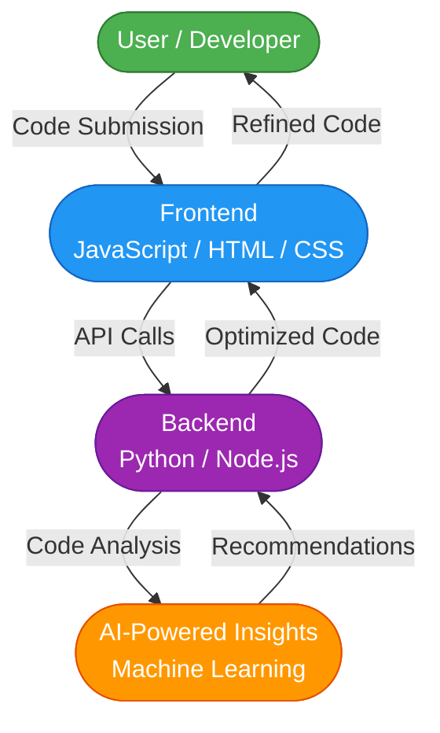

# GitRefiny_AI

[](https://github.com/Nisha-Mallick/GitRefiny_AI/stargazers)
[](https://github.com/Nisha-Mallick/GitRefiny_AI/network/members)
[](https://github.com/Nisha-Mallick/GitRefiny_AI/blob/main/LICENSE)
Revolutionizing Code Refinement with AI-Powered Insights

## Description

GitRefiny_AI is a cutting-edge project that leverages the power of artificial intelligence to refine and optimize code quality. By analyzing code patterns, detecting anomalies, and providing actionable insights, GitRefiny_AI helps developers write better, more maintainable code.

The primary purpose of GitRefiny_AI is to assist developers in identifying areas of improvement in their codebase, ensuring that their projects are scalable, efficient, and easy to understand. With its advanced AI-powered algorithms, GitRefiny_AI can help teams streamline their development process, reduce bugs, and improve overall code quality.

GitRefiny_AI is designed for developers, development teams, and organizations seeking to elevate their coding standards and best practices. Whether you're working on a personal project or a large-scale enterprise application, GitRefiny_AI is the perfect tool to help you refine your code and take your development skills to the next level.

## Features

* 🌟 **Code Analysis**: In-depth analysis of code patterns and structures
* 🚀 **AI-Powered Insights**: Actionable recommendations for code improvement
* 📈 **Code Optimization**: Suggestions for performance enhancements
* 🚫 **Bug Detection**: Identification of potential bugs and errors
* 📊 **Code Metrics**: Detailed metrics on code quality, complexity, and maintainability
* 📝 **Code Review**: Automated code review and feedback
* 🤖 **AI-Driven Refactoring**: Intelligent code refactoring suggestions

## Tech Stack
### Frontend


### Backend


### Database

No database technologies detected.

### DevOps & Tools


## Architecture



## Project Structure

```plain
├── .env.example
├── .firebaserc
├── .gitignore
├── .kiro
├── .kiro/
├── README.md
├── backend
├── firebase.json
├── firestore.indexes.json
├── firestore.rules
├── frontend
├── frontend/
├── spec.yml
├── test_api_keys.py
├── test_mermaid_diagram.py
├── test_tech_icons.py
```

## Installation

To install the required dependencies, run the following command:
```bash
npm install
```
Or, if you're using yarn:
```bash
yarn install
```

## Usage

To start the application, run the following command:
```bash
npm start
```
Or, if you're using yarn:
```bash
yarn start
```

## API Documentation

No API documentation available.

## Contributing

Contributions are welcome! Please submit a pull request with your changes and a brief description of what you've added or fixed.

## License

This project is licensed under the MIT License.

## Contact/Support

For issues, discussions, or support, please visit our [GitHub issues page](https://github.com/Nisha-Mallick/GitRefiny_AI/issues) or [GitHub discussions page](https://github.com/Nisha-Mallick/GitRefiny_AI/discussions).
